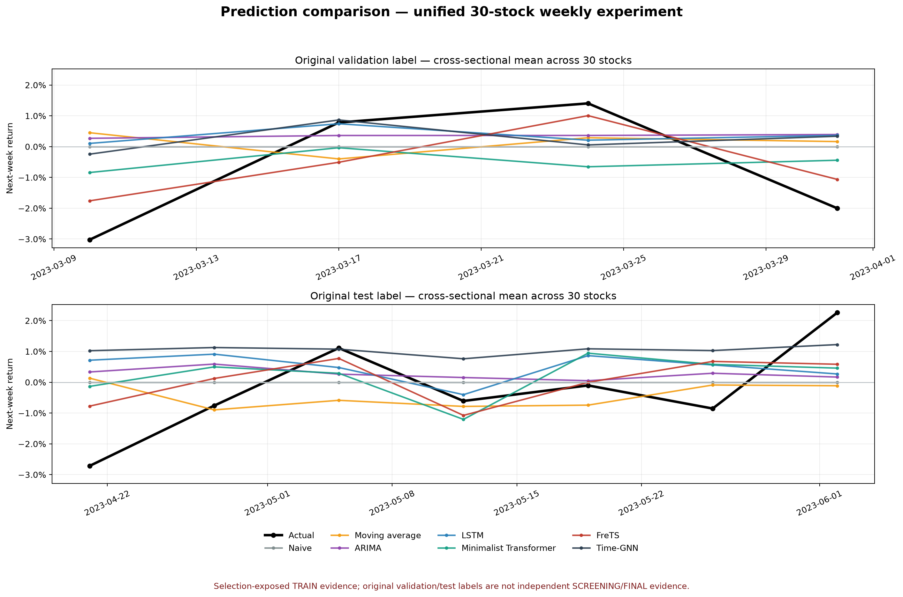
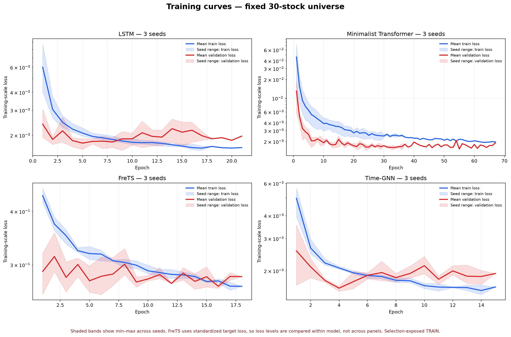

# 阶段 B：30 股票统一基线首轮报告

## 1. 完成范围

本轮在阶段 A 固定数据集 `weekly_30stocks_stage_a_v1` 上完成统一实验框架与前三类基线部署。

- 数据：30 只股票，训练 688、验证 120、测试 210 个下一周预测样本。
- 统一目标：预测下一周前复权收益率 `target_return`，并还原预测收盘价。
- 统一管理：JSON 配置、Python/NumPy/PyTorch 随机种子、控制台与文件日志、环境记录、耗时。
- 统一指标：MSE、MAE、RMSE、零值安全 MAPE、方向 Accuracy、方向 F1、逐股票指标。
- 统一产物：预测 CSV、指标 JSON、解析后配置、环境信息、LSTM 权重和训练历史。
- 随机种子：20260723、20260724、20260725。

传统基线实际提供 `naive` 与 `moving_average` 两个变体，并已接入 Minimalist Transformer、FreTS 和 Time-GNN，
因此当前共运行七个模型名称、21 次实验。

## 2. 测试集结果（三随机种子均值）

| 模型 | MAE | RMSE | 方向 Accuracy | 方向 F1 | 说明 |
|---|---:|---:|---:|---:|---|
| Naive | 0.034914 | 0.049811 | 51.43% | 0.0000 | 固定预测下一周收益为 0 |
| ARIMA(1,0,0) | 0.035983 | 0.051537 | 51.43% | 0.5278 | 逐股票滚动一步预测 |
| 移动平均(4 周) | 0.038482 | 0.054710 | 50.00% | 0.4068 | 使用截至预测时点的最近 4 周收益 |
| LSTM | 0.041684 ± 0.001313 | 0.061234 ± 0.004463 | 49.52% | 0.5169 | 8 周窗口、30 个数值/文本特征 |
| Minimalist Transformer | 0.039334 ± 0.002094 | 0.057612 ± 0.003424 | 52.54% | 0.5222 | 单层、4 头、9,889 参数 |
| FreTS | 0.037504 ± 0.001122 | 0.055121 ± 0.001959 | 55.40% | 0.5725 | 上游频域模型、8 周收益序列 |
| Time-GNN | 0.042412 ± 0.005020 | 0.058338 ± 0.005204 | 49.05% | 0.5188 | 动态时间图、36,742 参数 |

验证集 MAE：Naive 0.036745、FreTS 0.037213 ± 0.000642、Minimalist Transformer 0.038305 ± 0.001612、
ARIMA 0.038308、移动平均 0.039316、Time-GNN 0.041959 ± 0.005138、LSTM 0.042190 ± 0.002465。

## 3. 结果判断

当前一年期小样本上，Naive 的 MAE/RMSE 最低；FreTS 是表现最好的复杂模型，Minimalist Transformer 明显优于 LSTM，
但尚未超过简单模型。这不表示复杂模型路线无效，而是说明现阶段序列长度不足，
并且周收益噪声较强。ARIMA 的方向 F1 高于 Naive，LSTM 的方向 F1 与 ARIMA 接近，但误差和随机种子波动更大。
因此暂不扩大股票池的决策是正确的，应先完成后续模型适配、特征消融和窗口/损失调参。

Naive 的方向 Accuracy 较高但 F1 为 0，是因为零收益预测从不预测上涨；在验证集下跌样本占比较高时，
Accuracy 会产生误导。因此后续模型比较必须同时查看方向 F1，不能只看 Accuracy。

## 4. 部署与外部模型核对

- FreTS：源码、虚拟环境与入口 `run_longExp.py` 已存在，但目前仍是 COVID 等上游数据配置，需要金融适配器。
- Time-GNN：源码、虚拟环境与入口 `TimeGNN_train.py` 已存在，但目前仍是 weather 配置，需要金融图数据适配器。
- `sep-main`：实际是 Summarize-Explain-Predict 自反思大语言模型项目，不是数值时序 Transformer 基线，不能代替首批基线中的 Transformer。
- 在线安装新的 PyTorch/statsmodels 环境时下载长时间无响应。本轮 LSTM 复用 Time-GNN 已部署的 PyTorch CPU 环境；
  ARIMA(1,0,0) 使用数学上等价的带截距 AR(1) 闭式最小二乘后端。若后续测试其他 `(p,d,q)`，仍需安装 statsmodels。

## 5. 下一步

1. FreTS 收益序列长度和通道设计的有界消融已完成；4 周收益配置仅作为选择暴露 TRAIN 发现保留。
2. Minimalist Transformer“仅价格/价格+文本”消融已完成；当前文本增量分支被拒绝。
3. Time-GNN 稳定化结构节点 `timegnn-stabilized-v2` 已登记，尚待实现和训练。
4. 预测对比图与训练曲线图已生成，实验继续保持 30 股票规模。
5. 仅在候选与规则冻结、独立复算完成并获得授权后，才获取未来 SCREENING 数据。

生成的模型权重、日志、预测和本地数据位于 `outputs/`，受 `.gitignore` 管理，不提交到公开仓库。

## 6. 图表

### 30 股票预测对比

### 三随机种子训练曲线

两张图均为选择暴露 TRAIN 结果，仅用于模型比较和工程诊断，不是独立 SCREENING/FINAL 证据。

## 7. 有界消融更新（2026-07-23）

本节覆盖第 5 节中关于 FreTS 与 Minimalist Transformer 的后续任务。两组实验继续使用
固定 30 股票、相同 split 和三个随机种子。validation 与原 test 标签均已被研究过程查看，
因此以下结果统一标记为 `SELECTION_EXPOSED_TRAIN_NON_INDEPENDENT`，不能作为独立
SCREENING/FINAL 证据。

### 7.1 FreTS 序列长度与通道设计

| 配置 | Validation MAE | 原 test MAE | 判断 |
|---|---:|---:|---|
| 4 周收益单通道 | **0.035475 ± 0.000660** | **0.035191 ± 0.000380** | 当前误差最小，但仍为选择暴露 TRAIN |
| 8 周收益单通道 | 0.037213 ± 0.000642 | 0.037504 ± 0.001122 | 原父配置 |
| 12 周收益单通道 | 0.038107 ± 0.000242 | 0.036835 ± 0.000116 | 更长窗口未改善 validation 误差 |
| 8 周收益+OHLC 多通道 | 0.037207 ± 0.000432 | 0.037064 ± 0.001812 | 多通道未产生稳定增量 |

4 周窗口相对 8 周父配置降低 validation MAE 约 4.7%，但原 test 标签 MAE 仍略高于
Naive 的 0.034914，且方向 F1 不及 8 周配置。因此 FreTS 消融节点保持 `INCONCLUSIVE`，
不锁定候选，也不扩大股票池。

### 7.2 Minimalist Transformer 价格/文本消融

| 特征视图 | Validation MAE | 原 test MAE | 判断 |
|---|---:|---:|---|
| 仅价格 | **0.035717 ± 0.001009** | **0.037213 ± 0.000736** | 优于价格+文本 |
| 价格+文本 | 0.037081 ± 0.000472 | 0.037934 ± 0.000390 | 当前文本增量分支被拒绝 |

增加当前文本特征后，validation MAE 上升约 3.8%。结合训练期非空文本仅 15 行，现有
文本覆盖不足以支持稳定的增量误差收益。该结论只针对当前文本数据与编码实现，不表示
文本模态在更完整数据下无效。

完整消融记录见 [BOUNDED_ABLATIONS_TRAIN_RESULT.md](BOUNDED_ABLATIONS_TRAIN_RESULT.md)。
